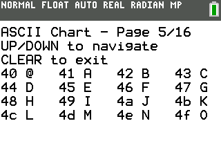

# TI-84 CE ASCII Chart Viewer

A simple utility program for the TI-84 CE calculator that displays ASCII and extended ASCII characters (0-255) on the text screen. This tool is particularly useful for programmers working with the TI-84 CE who need to identify special characters and their corresponding hexadecimal codes.

## Features

- Browse through all 256 ASCII/extended ASCII characters
- Organized display with 16 characters per page
- Shows both hexadecimal value and character representation
- Special handling for control characters (0x00-0x1F and 0x7F)
- Simple navigation using calculator keys

## Screenshots



## Requirements

- TI-84 CE Calculator
- [CE C/C++ Toolchain](https://github.com/CE-Programming/toolchain)

## Installation

1. Build the program using the CE C/C++ Toolchain:
   ```
   make
   ```
2. Transfer the resulting `.8xp` file to your calculator using TI Connect CE or similar software.

## Usage

- Launch the program from the calculator's program menu
- Navigate pages with the UP and DOWN arrow keys
- Exit the program by pressing CLEAR
- View character codes in hexadecimal format alongside their visual representation

## Building from Source

This project requires the CE C/C++ Toolchain. Follow these steps to compile:

1. Install the [CE C/C++ Toolchain](https://github.com/CE-Programming/toolchain) if you haven't already
2. Clone this repository
3. Run `make` in the project directory
4. The output file will be created in the `bin` directory

## Project Structure

```
.
├── src/
│   └── asci_text_main.c      # Main program code
└── README.md                 # This file
```

## Technical Details

- Written in C using the TI-CE toolchain
- Uses the standard text screen (8 rows × 26 columns)
- Implements custom handling for non-printable ASCII control characters
- Navigates through 16 pages with 16 characters per page

## Contributing

Contributions are welcome! Please feel free to submit a Pull Request.

## Acknowledgments

- CE Programming Team for the CE C/C++ Toolchain
- TI-84 CE Documentation

---

*This project is not affiliated with or endorsed by Texas Instruments.*