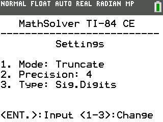

# MathSolver for TI-84 CE

A powerful mathematical expression evaluator for the TI-84 CE calculator, built with the CE C/C++ Toolchain.

## Overview

MathSolver is a calculator application designed specifically for the TI-84 CE that provides enhanced mathematical expression evaluation with step-by-step calculation tracking, variable support, and configurable arithmetic formatting.



## Features

- **Expression Parsing**: Parse and evaluate complex mathematical expressions with proper operator precedence
- **Step-by-Step Calculations**: View intermediate calculation steps to understand the solution process
- **Variable Support***: Store and recall variables for use in expressions
- **Mathematical Functions**: Built-in support for trigonometric, logarithmic, and other common functions
- **Calculation Modes**: Switch between normal, truncated, and rounded calculation modes
- **Precision Control**: Adjust precision by decimal places or significant digits
- **User-Friendly Interface**: Text-based UI optimized for the TI-84 CE screen
- **Debug Logging**: Built-in debug logger for development and troubleshooting

## Mathematical Capabilities

MathSolver supports:

- Basic arithmetic operations (`+`, `-`, `*`, `/`, `^`)
- Parentheses for grouping expressions
- Mathematical constants (`π`, `e`, `φ`)
- Functions: `sin`, `cos`, `tan`, `log`, `ln`, `sqrt`
- Factorial operator (`!`)

## Building the Project

### Prerequisites

- [CE C/C++ Toolchain](https://github.com/CE-Programming/toolchain)
- Make build system
- [CEmu](https://github.com/CE-Programming/CEmu) (for emulation)
- Git (optional, for version control)

### Compilation

1. Clone the repository:
   ```
   git clone https://github.com/yourusername/mathsolver-ti84ce.git
   cd mathsolver-ti84ce
   ```

2. Build the project:
   ```
   make
   ```

   The creation of forward declaration header files has been automated via PowerShell.
   Simply run the `build.ps1` script.

3. The output will be a `.8xp` file that can be transferred to your TI-84 CE calculator.

## Usage

### Installation

Transfer the compiled `.8xp` file to your calculator using TI Connect CE or another transfer tool.

### Basic Usage

1. Launch the program from the calculator's program menu
2. Enter a mathematical expression using the calculator's keypad
3. Press `ENTER` to evaluate the expression
4. Use the arrow keys to navigate through calculation steps
5. Press `MODE` to access the settings menu

### Settings

Access the settings menu by pressing `MODE` in the result screen:

1. **Mode**: Toggle between Normal, Truncate, and Round arithmetic modes
2. **Precision**: Set the number of decimal places or significant digits
3. **Type**: Switch between decimal places and significant digits

## Architecture

The project is organized into several modules:

- **Main**: Program entry point and initialization
- **MathSolver Core**: Expression parsing and evaluation
- **Tokenizer**: Converts input strings to tokens
- **Parser**: Builds expression trees from tokens
- **Evaluator**: Evaluates expression trees
- **Arithmetic**: Handles number formatting and precision
- **Variables**: Manages variable storage and retrieval
- **UI**: Text-based user interface components
- **Keyboard Handler**: Callback-based input handling
- **Logger**: Debug logging system

*Variable support is implemented in the code but is not yet accessible through the UI.

## License

This project is licensed under the MIT License. See the LICENSE file for details.

## Roadmap

The following features are planned for future releases:

- **Summation Operations**: Implementation of summation (∑) functionality for series calculations
- **Product Operations**: Implementation of product (∏) operations for multiplication series
- **Additional Mathematical Functions**: Expanding the available function library
- **UI Access to Variables**: Adding UI components to create, view, and edit variables

## Contributing

Contributions are welcome! Please feel free to submit a Pull Request.

1. Fork the repository
2. Create your feature branch (`git checkout -b feature/amazing-feature`)
3. Commit your changes (`git commit -m 'Add some amazing feature'`)
4. Push to the branch (`git push origin feature/amazing-feature`)
5. Open a Pull Request

## Acknowledgements

- TI-84 CE C/C++ Toolchain developers
- Texas Instruments for their calculator platform